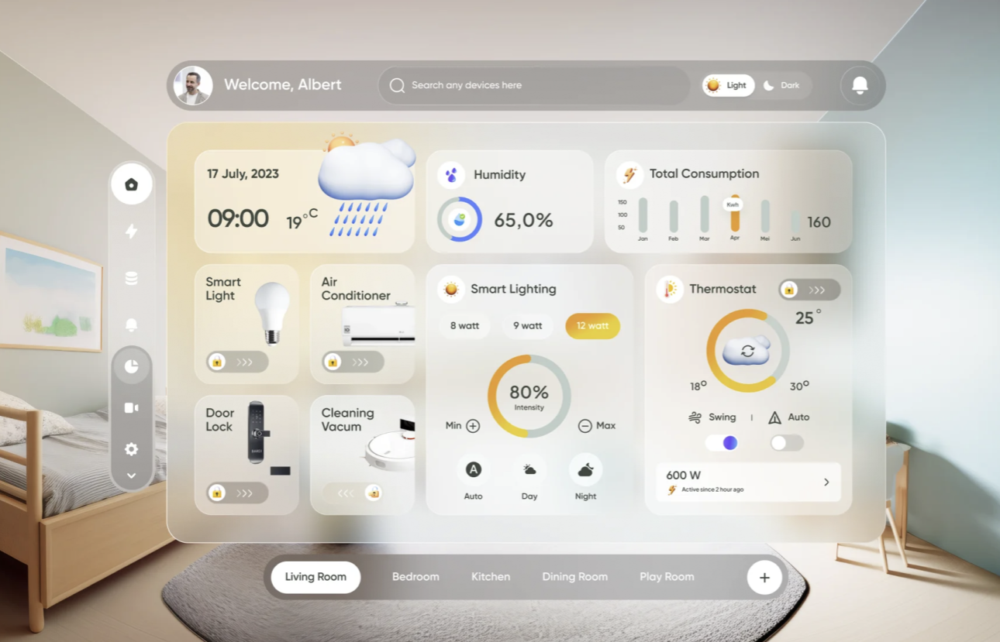
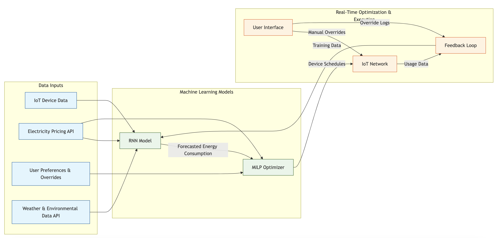
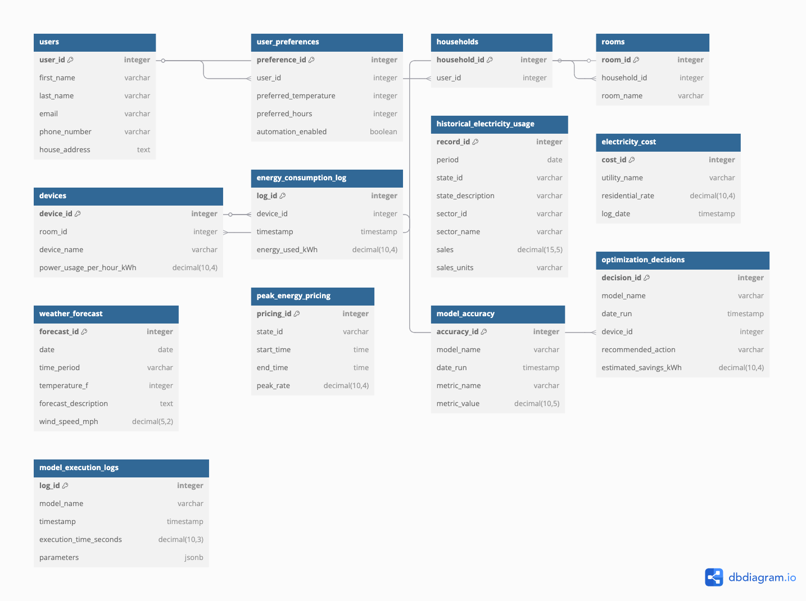

# Pulse: Universal Energy Management System

## Overview

The **Universal Energy Management System (UEMS)** is a smart home energy management interface that connects IoT and non-IoT devices to a centralized console. The front page is designed to provide an intuitive and interactive user experience, allowing users to monitor and optimize their energy consumption efficiently.

This repository contains the **frontend** and **backend** components of the UEMS dashboard. The system provides real-time energy tracking, smart device control, and an **optimization model** to minimize electricity costs.

---

## System Architecture

### Hybrid Machine Learning (HML) Model Mapping

The **Hybrid Machine Learning (HML) model** combines **Recurrent Neural Networks (RNNs)** for energy demand prediction and **Mixed-Integer Linear Programming (MILP)** for real-time decision-making. This approach ensures both **predictive planning** and **optimal real-time adjustments** to minimize energy costs.

**HML Breakdown:**
- **RNN (LSTM/GRU):** Predicts household energy demand based on historical usage patterns.
- **MILP:** Optimizes device operations based on electricity rates, demand, and constraints.
- **Data Inputs:** IoT device power usage, historical energy trends, real-time electricity pricing, and weather conditions.

---

### Entity-Relationship Diagram (ERD)

The **UEMS database** is structured to store user settings, energy usage logs, device configurations, and optimization outputs.

**Key Entities:**
- **Users**: Stores login credentials and user preferences.
- **Devices**: Contains details about connected IoT and non-IoT devices.
- **Energy Logs**: Tracks historical energy consumption.
- **Optimization Results**: Stores recommendations from the HML model.

---

## Features

- 📊 **Real-Time Energy Monitoring** – Track electricity consumption over time.
- 💡 **Smart Device Control** – Manage smart lights, thermostats, and appliances.
- 🌡 **Weather & Humidity Integration** – Optimize energy use based on external factors.
- 🔄 **Automated Optimization** – Adjust device settings dynamically to reduce costs.
- 🤖 **Hybrid Machine Learning Model (HML)** – Predicts energy demand and optimizes device usage.
- 🎨 **Modern UI Design** – Responsive, user-friendly interface.
- 🌍 **Room-Based Management** – View and control devices in specific rooms.

---

## Tech Stack

- **Frontend:** React.js, Tailwind CSS
- **Backend:** Flask (Python)
- **Database:** PostgreSQL
- **APIs:** OpenWeather API, IoT APIs (Tapo, Google Nest)
- **Optimization Model:** **RNN (LSTM/GRU)** for energy demand prediction, **MILP** for real-time decision-making.

---

## Prerequisites

Ensure you have the following installed:

- **Frontend:**
  - [Node.js](https://nodejs.org/)
  - [npm](https://www.npmjs.com/) or [yarn](https://yarnpkg.com/)

- **Backend:**
  - [Python 3.x](https://www.python.org/)
  - [Flask](https://flask.palletsprojects.com/)
  - [pip](https://pip.pypa.io/en/stable/)
  - [PuLP](https://coin-or.github.io/pulp/) (for MILP optimization)
  - [TensorFlow/PyTorch](https://www.tensorflow.org/) (for RNN model)

---

## Roadmap

- [x] Implement UI components for energy monitoring.
- [x] Develop HML model for energy optimization.
- [ ] Integrate backend API for real-time data updates.
- [ ] Add user authentication and personalized dashboards.
- [ ] Improve device control automation and scheduling.
- [ ] Deploy the app to a cloud-based platform.

---

## Contributing

1. Fork the repository.
2. Create a new branch (`feature-branch-name`).
3. Commit your changes.
4. Push to your branch and open a pull request.

---

## License

This project is licensed under the **MIT License**.

---

### 📬 Contact

For any questions or contributions, feel free to reach out!

- **Developer:** Luke Alexander Wolf
- **Email:** [lawolf@usf.edu]
- **LinkedIn:** [Your LinkedIn Profile](https://linkedin.com/in/lukeawolf)
